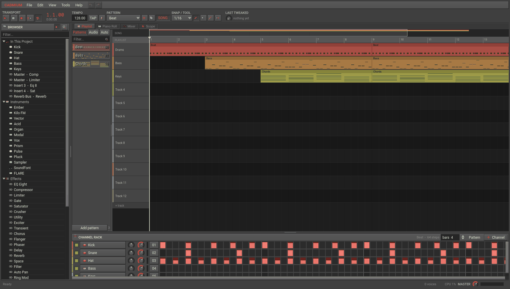
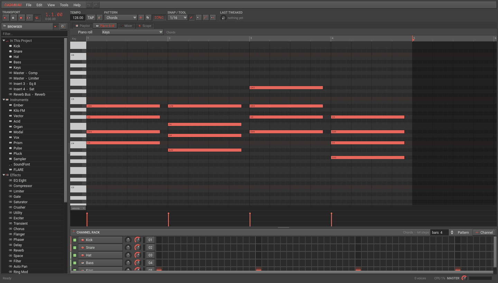
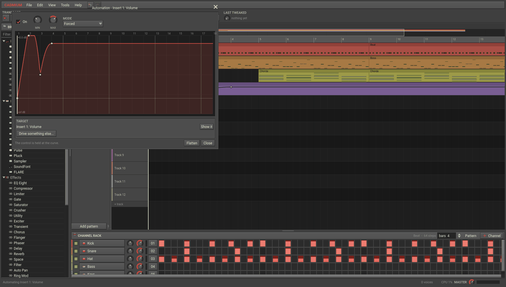
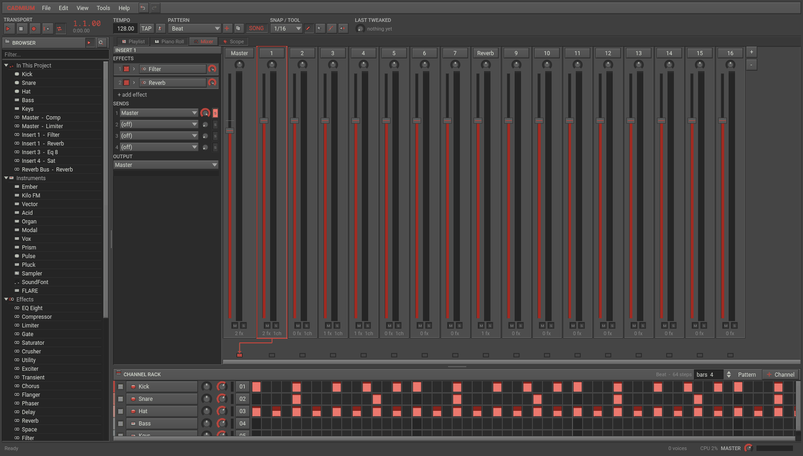
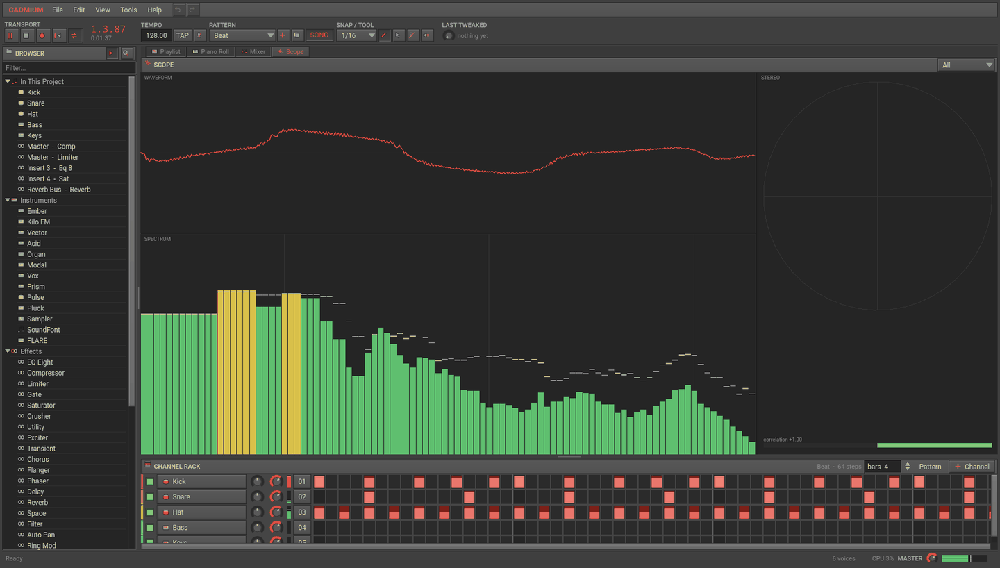
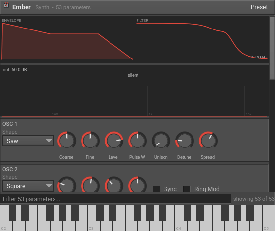

# Cadmium

A digital audio workstation for Linux and Windows: channel rack, piano roll,
playlist, mixer with sends and sidechains, a set of instruments and effects
written for it, a SoundFont player, a sampler, and VST3 hosting.

*Song mode: pattern clips drawing their own notes, the channel rack underneath,
the browser down the left.*

The interface follows Comotion's — Source 2 Hammer by way of a video editor:
neutral grey, square, dense, captioned panels. The primary colour is cadmium
red, and it is user-settable (Preferences ▸ Appearance).

    ~/Cadmium/cadmium          # or `cadmium` on PATH, or the desktop entry

---

## What is in it

**Sequencing**

- **Channel rack** — one row per instrument with a sixteenth-note step grid.
  Click a step, drag to paint, drag up or down on a lit step for velocity.
  Pattern length is set in bars from the rack's caption.
- **Piano roll** — draw, move, resize, rubber-band select, transpose, nudge,
  duplicate; a velocity lane underneath; notes from other channels drawn as
  ghosts. Ctrl+wheel zooms time, Alt+wheel zooms keys, the middle button pans.
  The end of the pattern is a handle on the ruler: drag it to make the pattern
  longer. Dragging a note auditions the pitch you are pointing at, not the one
  you picked up.
- **Playlist** — pattern clips, audio clips and automation clips on twelve
  tracks. An audio clip draws its own waveform, and starting the transport in
  the middle of one plays it from there. Zoomed out, the ruler numbers every
  2, 5, 10, 20 bars rather than every one, and puts the clock beside the bar
  number once bar numbers stop meaning much. Paint the current pattern with the left button, erase with the right,
  drag a clip's right edge to resize. Clips draw their own contents: a pattern
  clip shows its notes, an automation clip shows its curve.
- **Automation** — any mixer fader, channel volume, send amount, the tempo, or
  any parameter of any loaded plugin, as a clip on the playlist. Right-click a
  knob ▸ Create Automation Clip.
- **Transport** — pattern mode loops the selected pattern, song mode plays the
  playlist. Record arms live input: play the typing keyboard or a MIDI keyboard
  while the transport runs and the notes land in the current pattern, snapped.
  Pressing play part-way through a held note plays that note with what is left
  of it, and muting a track or channel cuts what it is already playing rather
  than waiting for the note to end.
  Tap tempo, a metronome, and a loop switch sit in the bar; undo and redo sit
  in the menu row; the load, voice count and master level sit in the status bar.
- **Layers** — a channel can play other channels alongside itself, each with its
  own transpose and level (right-click a channel ▸ Layers). Tick "silence this
  channel's own instrument" and it becomes a pure layer channel: one pattern
  driving a stack of instruments, which stays in step because there is only one
  set of notes.
- **Tools** — draw, select, slice and mute, on both the piano roll and the
  playlist. Tempo and musical key can be detected from any audio file.

*The piano roll on a four-bar chord pattern, with the velocity lane underneath.*

*An automation clip in its own editor, over the playlist it plays from.*

**Mixing**

- 16 inserts plus master, eight effect slots each, four sends per track, and a
  routing destination per track (so busses are just tracks).
- A send can feed the destination's **sidechain** instead of its audio, which is
  what the compressor's external detector and the vocoder's modulator read.
- Per-slot bypass and dry/wet, meters with peak hold and a clip latch,
  solo/mute, and a topological processing order so a bus is always mixed after
  everything that feeds it.
- The effect chain is a **stack**: filled slots and one "add effect" row, each
  slot draggable to reorder, with an arrow that folds out the first few
  controls so a filter can be swept without opening its window. Effects can be
  copied to another strip with their settings, and removing one closes the gap.
- Effects and instruments are chosen from a **searchable picker** — type to
  filter, browse by category, star favourites, and recent picks come back to the
  top.
- A **scope** on a tab of its own: what is actually leaving the master bus, as a
  waveform, a spectrum with peak hold and a stereo field with a correlation
  meter — all three at once, or one of them full size.

*The mixer: the selected strip's effect stack and its four sends on the left,
routing drawn under the strips.*

*The scope, reading the master bus while the song plays.*

**Instruments** (all written for Cadmium, all C++)

| | |
|---|---|
| **Ember** | Three-source subtractive: two oscillators with 7-voice unison, sub, noise, a Moog-style ladder filter with four modes, two envelopes, an LFO with tempo sync, glide, mono/poly, drift |
| **Kilo FM** | Four operators, eight algorithms, per-operator envelopes, feedback, fixed-frequency mode |
| **Vector** | Dual wavetable with six procedurally built tables, morphing from envelope and LFO, unison, state-variable filter |
| **Pulse** | Drum synth: kick, snare, clap, hi-hat, tom, rim, cymbal, with pitch envelope, body/noise split and drive |
| **Pluck** | Karplus–Strong string with pick position, damping and a body resonator |
| **Sampler** | One-shot or looped audio playback with start/end/loop markers, filter, envelope, reverse, velocity |
| **SoundFont** | A complete SF2 player: preset/instrument/sample zone resolution, DAHDSR volume and modulation envelopes, per-zone filter, mod and vibrato LFOs, exclusive classes, loop modes |
| **Acid** | Monophonic bass: overlapping notes slide instead of retriggering, hard velocity accents open the filter, ladder filter with its own decay envelope |
| **Organ** | Nine drawbars on the real ratios, percussion tap, key click, and a rotary cabinet with doppler on the horn — **drag the drawbars themselves** |
| **Modal** | Struck resonator bank: bell, marimba, glass, metal and tube, with strike position, inharmonicity and mallet tone |
| **Vox** | Formant ensemble: three detuned voices through vowel filters you can sweep between, with breath and vibrato |
| **Prism** | **Plays a picture.** Left to right is time, up is pitch, brightness is how loud that partial is, and colour decides where it sits in the stereo image. A bank of sine oscillators, one per row, turns it back into sound; the panel shows the picture with the scan line running across it |

*Ember, one of the stock instruments. Every instrument window is built the same
way: its own displays at the top, every parameter searchable underneath, and a
keyboard at the foot.*

**Effects**

EQ Eight (draggable curve over a live analyser), Compressor (transfer curve,
gain-reduction meter, external sidechain, RMS or peak detection, lookahead),
**Multiband** (three Linkwitz-Riley bands, each with its own compressor and
gain-reduction bar), Limiter, Gate, Saturator, **Tape** (wow, flutter, head
bump, hiss and side loss), Crusher, Utility, **Imager** (width per band, mono
below a frequency, goniometer and correlation), Exciter, Transient, Chorus,
Flanger, Phaser, **Trance Gate** (sixteen steps you draw on, locked to the
tempo, every step automatable), Delay (tempo-synced, ping-pong, ducking),
Reverb (8-line FDN), Space (partitioned-FFT convolution, loads any impulse
response), Filter, Auto Pan, Ring Mod / frequency shifter, Pitch Shift,
Vocoder.

**VST3**

Instruments and effects are hosted: the bundle is loaded, component and
controller are connected, buses are arranged, and every published parameter
appears as a knob that automates and saves like a stock one. Parameter groups
come from the plugin's own unit tree, values are formatted by the plugin, and
plugin state is stored inside the project. Verified against Vital, Surge XT,
sfizz, LSP and Surge XT Effects.

**Plugin-drawn editors are embedded**: the plugin's own interface is parented
into a child window under Cadmium's strip, and a "Plugin UI" checkbox (also on
the header's right-click menu) switches back to the generic panel at any time.
On Linux the host runs the plugin's event loop for it, which is what JUCE and
VSTGUI editors need in order to paint at all; keyboard focus is handed to the
plugin's own window while its window is active; a view that says it cannot be
resized locks its window to its own size; and an editor larger than the screen
is trimmed to fit and told about the trim, rather than opening a window with
its corners off the display.

Every VST3 on this machine — 226 of them, every distinct plugin toolkit among
them — is checked by `--cd-vsttest`: each one is loaded, two beats of audio are
rendered through it, its editor is opened, and the pixels are read back off the
X server, failing anything that attached without drawing. The same run reopens
each editor a second time, moves and resizes its window, and puts three editors
up at once.

Cadmium asks for the X11 backend even inside a Wayland session. The handshake
that lets a plugin draw into a window the host owns is defined for X11 and for
Windows; Wayland has no equivalent, so a native Wayland window would mean no
plugin interfaces at all.

**Files**

- Projects live in `Documents/Cadmium` by default, with `Exports/` and
  `Autosave/` beside them; every file dialog starts there until you go
  somewhere else. **File ▸ Open Recent** lists the last dozen.
- Closing a project with unsaved changes asks first, and offers to save rather
  than only to confirm. The browser's **In This Project** section lists the
  instruments, effects and files this project actually uses; opening one takes
  you straight to it.
- **Autosave** (Preferences, every five minutes by default) writes
  `<name>.autosave.cadmium` next to the project. It never writes over what you
  saved, and it does not clear the unsaved marker.
- Projects are `.cadmium` (readable JSON).
- MIDI import and export (SMF format 1, tempo included).
- Audio export to 16/24/32-bit WAV, whole song or current pattern, with a tail
  and optional normalisation; **Export Stems** writes one file per mixer track.
- Anything ffmpeg can decode can be a sample — wav, flac, mp3, m4a, opus, ogg,
  aiff, wma, aac, wavpack and the rest — converted to a float WAV in
  `user://cache` on the way in.
- **Long files are fine.** A WAV is read a chunk at a time rather than swallowed
  whole, so a full song costs what its samples cost and not twice that, and an
  overview is built as the samples go past — drawing the waveform of a
  two-minute file never walks its six million samples again.
- Every knob and fader resets from its own right-click menu.
- Clicking a file in the browser **plays it**, so you can hear what something is
  before loading it. Click it again to stop, or turn the preview off with the
  play button in the browser's title bar.
- MIDI input over ALSA, subscribed automatically (Godot's own MIDI API segfaults
  on this system, so the engine talks to the sequencer itself).
- The piano roll has a **menu of its own** -- scores, MIDI, and everything it can
  do to what is in it. See below.

### Scores

A pattern is worth keeping on its own, separately from the song it was written
for: a riff, a drum part, a chord progression. **Piano roll > File > Save score
as** writes one as a `.cdscore`, and they live in `Documents/Cadmium/Scores`.

It is Cadmium's own format rather than MIDI because MIDI cannot carry what the
piano roll actually edits: a note's pan and its fine pitch, which channel of the
rack it belongs to, and what instrument that channel was. Opening a score into
an empty project brings its channels with it, playing the instruments they were
written for; opening one into a project that already has channels of those names
lands on those instead of making a second set.

MIDI is the other half of the same menu, and it goes **into the pattern you are
editing** rather than building a project around itself. A file with one part
lands on the channel the piano roll is pointing at; a file with several gets a
channel each, matched by name. The tempo is reported and not applied -- note
positions are in beats, so it makes no difference to where anything lands.
Dropping a `.mid` on the window follows the same rule: into the pattern when the
piano roll is open, into the project otherwise.

There is no MIDI clipboard on a desktop, so **Copy to MIDI clipboard** puts a
whole MIDI file on the ordinary text clipboard as base64 behind a marker line.
Another Cadmium pastes it straight back; anything else at least gets text it can
keep.

**Export as score sheet** writes the part out to read rather than to play: every
note by bar, beat, name, length and velocity. A listing, not engraved notation.

---

## How it is put together

The interface is scene files. `ui/main.tscn` is the window; each panel, dialog
and repeated item is its own `.tscn`, and the script beside it wires the thing
up rather than building it. Three kinds of thing stay in code, for reasons:

- **What the plugin decides.** A hosted VST3 publishes its own parameters --
  Vital has 2855 -- so its panel is built from the descriptor at run time.
- **What the project decides.** How many channels, strips, sends or clips there
  are is not known until it is loaded, so those are *instanced* from item
  scenes (`channel_row.tscn`, `mixer_strip.tscn`, `send_row.tscn`,
  `fx_slot.tscn`, `layer_row.tscn`) rather than laid out one by one.
- **What is drawn rather than assembled.** The piano roll, the playlist and the
  scope are single canvases with a `_draw` call; there are no child controls to
  put in a scene.

Icons are the other exception: they are rasterised from SVG at run time so the
accent colour can change, so they are assigned in `_ready` rather than baked in.

    native/      C++ audio engine (GDExtension) — everything on the audio thread
      dsp.h        filters, envelopes, oscillators, delay lines, FFT
      plugin.h     the interface stock and hosted processors share
      synths.cpp   Ember, Kilo, Vector
      drums.cpp    Pulse, Pluck
      effects*.cpp the effect set
      sampler.cpp  Sampler and the SoundFont player
      sf2.cpp      SoundFont 2 reader, with a shared sample cache
      vst3_host.cpp  the VST3 host: module loading, buses, events, state
      midi_in.cpp  ALSA sequencer input
      engine.cpp   transport, sequencer, mixer graph, offline render
      cd_node.cpp  the Godot node and the AudioStream that pulls from it
    core/        project model, MIDI, scores, palette, icons, tests
    autoload/    settings, accent, icons, audio, plugin catalogue, app, keys
    ui/          panels (rack, piano roll, playlist, mixer, browser) and widgets
    themes/      generated by tools/build_theme.gd

The engine holds the song in C++ and is the authority while audio runs; the
GDScript side is the authority for editing, undo and the file on disk. `App`
keeps the two in step and is the only thing that talks to the engine.

The audio thread takes a `try_lock`; a failed lock outputs one silent block
rather than reading a half-edited structure. Structural edits (loading a
plugin, reading a 30 MB soundfont) do their work outside the lock and only swap
pointers inside it.

Rendering is the same code path as playback with the transport driven by a
loop instead of the device, so an export sounds exactly like the mix.

### Building the engine

    cd native
    scons platform=linux target=template_release custom_api_file=$PWD/extension_api.json -j$(nproc)

Needs `godot-cpp` (vendored in `native/godot-cpp`), the VST3 SDK's
`pluginterfaces` and `base` headers (vendored in `native/vendor/vst3`, MIT —
see its `LICENSE.txt`), and `libasound`.

### Windows

The engine cross-compiles with mingw:

    cd native
    scons platform=windows target=template_release use_mingw=yes custom_api_file=$PWD/extension_api.json -j$(nproc)

MIDI input goes through winmm there, and VST3 bundles are loaded from
`Contents/x86_64-win` through `InitDll`.

### Building a release

    tools/package.sh linux | windows | linux-arm64 | all

Cross-builds the engine, exports, regenerates the licence bundle out of the
engine, stages `content/` (the soundfont and the FLARE banks, which live beside
the executable rather than in the `.pck`) and zips it into `dist/`.

**`docs/RELEASE.md` is the runbook** — prerequisites, what each target's status
actually is, how to check a packaged build, and the publishing commands. Read
the three open questions at the top of it before publishing anything.

### Test hooks

All of these take a real window; `--headless` uses the dummy renderer.

    xvfb-run -a -s "-screen 0 1600x900x24" godot-beta --path . --rendering-driver opengl3 -- <hook>

    --cd-selftest=<dir>   every instrument and effect rendered and measured, VST3
                          load/render/state, sampler, project and MIDI round
                          trips, undo, automation. Prints a pass/fail tally.
    --cd-audiotest        plays the demo through the real device and reports the
                          engine's master peak, Godot's bus peak, voices and CPU
    --cd-shot=<png>[,view]  screenshot; view is playlist|piano|mixer|scope|
                          plugin|fx|picker|layers|vst3|sf2, or demo_<view> to
                          build the demo first. piano:<pattern>[:<channel>]
                          photographs a particular one rather than whatever is
                          selected. vst3hold:<name> opens a hosted plugin's own
                          editor and leaves it up to be captured.
    --cd-vsttest=<dir>[,filter[,skip]]
                          renders audio through every hosted plugin, opens its
                          own editor, reads back what it painted and saves it as
                          a PNG; then reopens, moves, resizes, and runs three at
                          once. Needs a real X display.
    --cd-open=<file>      open a project

### Projects that move between machines

A `.cadmium` file records absolute paths, and an absolute path is a fact about
one computer. Opening a project somewhere else finds its parts again rather than
loading nothing:

- **Hosted plugins by VST3 class id**, which is identical on every platform for
  the same plugin, so a Linux project opens on Windows against the Windows copy.
  The recorded path is tried first because it is usually right; the class id,
  then the bundle's file name, then the plugin's name are the fallbacks
  (`Plugins.locate_vst3`).
- **Files beside the project.** Samples, soundfonts, impulse responses and
  Prism's picture are looked for where the project says, then next to the
  `.cadmium`, then in `Samples/`, `Audio/` or `Content/` beside it, then under
  this machine's home rather than the one that saved it (`App.find_file`).
- **A missing sample keeps its slot.** The engine is told which index a sample
  goes in (`set_audio`) rather than asked for one, because dropping a missing
  sample renumbers every later one and the clips then play the wrong audio.
- **Whatever is still missing is reported** in one list when the project opens,
  rather than as status lines that scroll past.

## Bugs, and sending a change

**Something is broken:** [open an
issue](https://github.com/Kujyssisi/Cadmium/issues/new/choose). If Cadmium
stopped rather than misbehaved, **Help ▸ Crash Reports…** holds what it was
doing at the time and copies it to the clipboard — a host that loads other
people's code cannot be crash-proof, so it writes that down instead. Paste it
in with the steps that got you there.

**Something should work differently:** open an issue for that too, and say what
you were trying to get done rather than only the feature you have in mind for
it. Sometimes there is already a way.

**You have fixed it yourself:** fork, branch, run `--cd-selftest`, and open a
pull request against `main`. You do not need to ask first. Every one gets read
and either merged, sent back with a question, or — when the fix turns out to
belong somewhere else in the engine — written here instead, with the commit
crediting you and linking the pull request.

`CONTRIBUTING.md` has the build and test commands, the house style, and the
three rules that get a change sent back regardless of how well it works: the
audio thread allocates nothing, an export is the playback path, and new
dependencies are agreed before they are written.

## Licence

Cadmium is **free software under the GNU General Public License, version 3 or
later**. You may use it, study it, change it and share it; if you distribute a
modified version you have to publish your changes under the GPL as well. The
full text is in `LICENSE` and the notice is in `COPYRIGHT`.

`THIRD-PARTY-NOTICES.md` covers everything else: Godot and godot-cpp (MIT), the
VST3 interfaces (MIT), FluidR3_GM (MIT), Roboto (Apache-2.0) and Noto Sans Mono
(OFL-1.1). All of them are GPL-compatible and none of them forced the choice.
Two things in that file are still open: the provenance of the metronome samples,
and the Steinberg trade mark on the word "VST".

## Keyboard

Space play/pause · Ctrl+Space play from start · Enter stop · L pattern/song ·
Esc all notes off · F5 playlist · F6 rack · F7 piano roll · F9 mixer ·
Ctrl+Z / Ctrl+Shift+Z undo/redo · Ctrl+S save · Ctrl+E export ·
Ctrl+X/C/V cut, copy, paste · Ctrl+D duplicate · Ctrl+Q quantize ·
Ctrl+A select all · Delete remove selection · Home / End jump ·
Ctrl+R record · Ctrl+M metronome · Ctrl+L loop · Ctrl+T tap tempo ·
Ctrl+F add effect · Ctrl+Shift+N new pattern · Ctrl+Shift+D duplicate pattern ·
1-4 draw, select, slice, mute tools · Ctrl+± zoom ·
arrows nudge and transpose ·
Z S X D C V G B H N J M / Q 2 W 3 E R 5 T 6 Y 7 U play notes · `[` `]` octave
